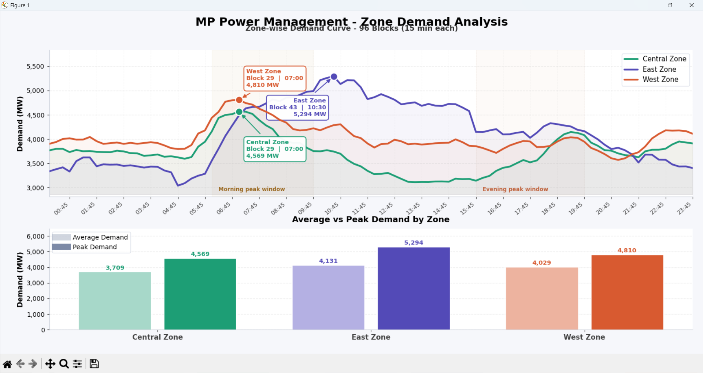

# ⚡ Zone Demand Analysis GUI Tool

> A desktop application for zone-wise electricity demand analysis,
> built for DISCOM operations at MP Power Management Co. Ltd.

---

## 📌 Problem Statement
DISCOMs need to analyze daily zone-wise electricity demand patterns
to plan procurement, optimize scheduling, and reduce DSM penalties.
Manual Excel-based analysis is time-consuming and error-prone.

## 💡 Solution
An interactive desktop GUI that loads zone-wise demand data,
visualizes patterns across time blocks, and exports insights — 
reducing analysis time significantly.

---

## 🖥️ Screenshots


---

## 🛠️ Tech Stack
| Tool | Purpose |
|------|---------|
| Python | Core language |
| Tkinter | Desktop GUI framework |
| Pandas | Data processing |
| Matplotlib | Charts & visualization |
| OpenPyXL | Excel read/write |

---

## ⚙️ How to Run

```bash
# Clone the repo
git clone https://github.com/YOUR_USERNAME/Zone-Demand-Analysis-Tool.git

# Install dependencies
pip install -r requirements.txt

# Run the app
python src/main.py
```

---

## 📊 Features
- ✅ Load zone-wise demand data from Excel
- ✅ Block-wise demand trend visualization
- ✅ Zone comparison charts
- ✅ Peak demand identification
- ✅ Export analysis to Excel

---

## 🏭 Domain Context
Built for **DISCOM operations** in the Indian power sector.  
Zones represent distribution circles under MP PPMCL.  
Demand data is in **96 time blocks** (15-min intervals) per day.

---

## 👤 Author
**Duvvada Naveen Kumar**  
Data Analyst, MP Power Management Co. Ltd.  
[LinkedIn](https://linkedin.com/in/duvvada-naveen-kumar)